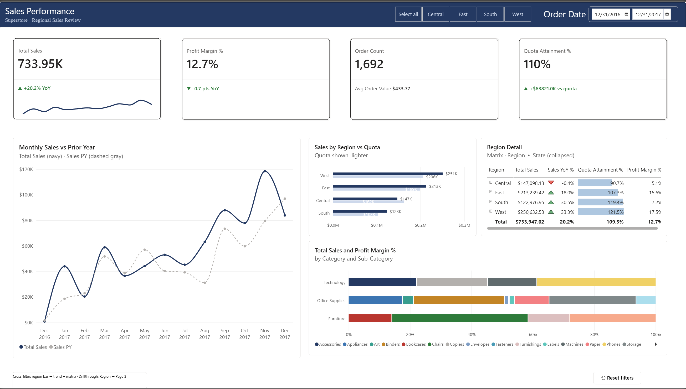
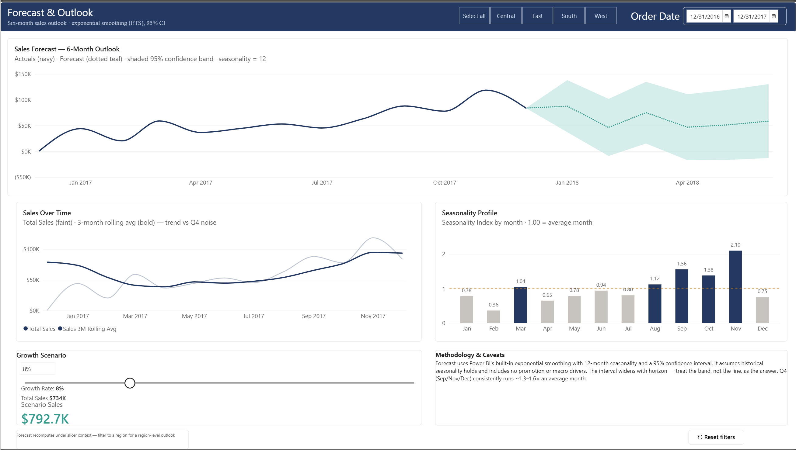
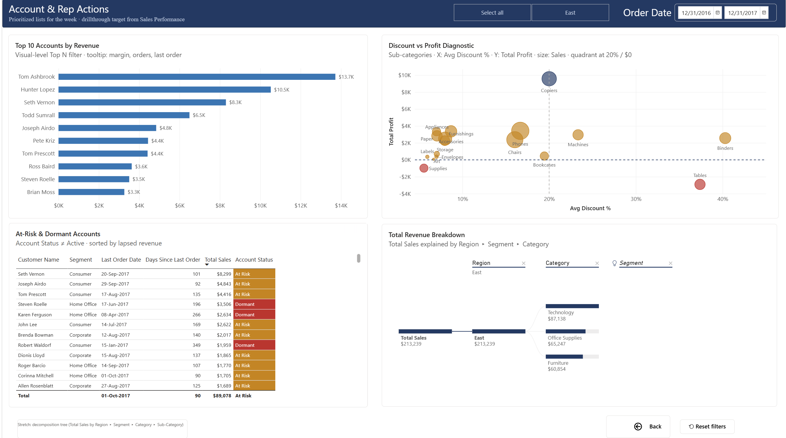
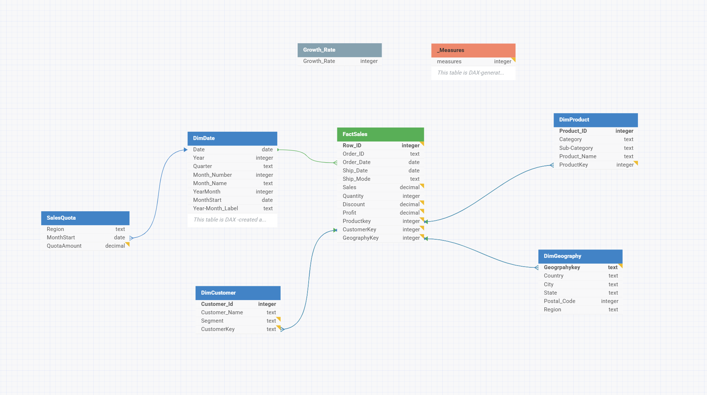

# Superstore Retail Sales Analysis & Forecasting — Power BI

Three-page sales-team report on the public Superstore dataset:
star-schema model, 34-measure DAX layer, Region×Month quota framework,
6-month ETS forecast with 95% CI — built in a deliberate 4-hour timebox.

The repository also carries the evaluation layer — the model audit and its
remediation record, the runbook that turns the written specification into
executable tests, and the dashboard that publishes the results — plus a
companion guide for migrating the whole solution to a Microsoft Fabric
Lakehouse with a Direct Lake semantic model.

## Report pages

## Data model

## Highlights

- Single CSV split into a proper star schema — `FactSales` plus `DimProduct`,
  `DimCustomer`, `DimGeography` and a DAX-generated `DimDate`
- Quota framework generated in-model (PY actuals × 1.10) — `SalesQuota` is a second
  fact at Region × month grain, bridged to geography with a `TREATAS` virtual join
- Native ETS forecast (season length 12, 95% CI) plus a what-if growth-rate scenario
  driven by a disconnected `Growth Rate` parameter table
- Account action lists: top-10 revenue, at-risk/dormant flags, discount-vs-profit diagnostic
- PBIP source control: every DAX change is a readable line diff

## Model at a glance

| | |
|---|---|
| Fact grain | One row per order line — 9,994 rows |
| Date coverage | 2014-01-03 → 2017-12-30 (`DimDate` spans 2014-01-01 → 2017-12-31, 1,461 rows) |
| Dimensions | Product 1,894 · Customer 793 · Geography 632 |
| Quota | 4 regions × 36 months = 144 rows, Jan 2015 → Dec 2017 |
| Measures | 34, in six display folders, hosted on `_Measures` |
| Storage mode | Import |

Unfiltered control totals — Total Sales **$2,297,201**, Total Profit **$286,397**,
Profit Margin **12.5%**, Order Count **5,009**, Active Customers **793**.
`Sales PY`, `Sales YoY %` and every quota measure are blank for 2014 by design.

## Data source (not redistributed here)

- Superstore Dataset (Kaggle): <https://www.kaggle.com/datasets/vivek468/superstore-dataset-final>
- Tableau sample-data page: <https://public.tableau.com/app/learn/sample-data>

Download the CSV from either source to rebuild; the repo contains no data files.

## Document set

Everything in `docs/`, numbered in lifecycle order. Numbers are assigned in
blocks — 01–19 build, 20–29 evaluation, 30+ platform — and are never reused.

| # | Document | What it is |
|---|----------|------------|
| 01 | `01_Project_Plan_Retail_Sales_Forecasting.docx` | Scope, timebox, cut-order guardrails, packaging checklist |
| 08 | `08_GitHub_Repository_Setup_Guide.docx` | Repository design and the Git / PBIP workflow, no prior Git assumed |
| 12 | `12_PBI_Report_Mockup.html` | Interactive static mockup of the three report pages |
| 13 | `13_Visual_Build_Instructions.docx` | Click-by-click build of every visual, with the conformance spec |
| 15 | `15_Development_Guide.docx` | End-to-end build walkthrough: model, DAX, report |
| 18 | `18_Enhanced_Time_Intelligence_Calendar_Reference_2.docx` | Reference for the optional enhanced time-intelligence calendars — not a build requirement |
| 20 | `20_Data_Dictionary.xlsx` | Source, model, measure and relationship dictionary |
| 21 | `21_Model_Evaluation_Report.docx` | Dated audit: nine defects found and fixed, documentation errors corrected |
| 22 | `22_Evaluation_Framework.docx` | The evaluation runbook and the dashboard that publishes it — specification as executable tests |
| 24 | `24_Evaluation_Dashboard_Mockup.html` | Interactive static mockup of the three evaluation dashboard pages |
| 30 | `30_Fabric_Lakehouse_Migration_Guide.docx` | Migrating the solution to a Fabric Lakehouse with a Direct Lake model |

The two HTML mockups render in the browser straight from the raw file — no
build step, no dependencies.

Number 23 is retired: it was the evaluation dashboard build specification, and
it was merged into 22 on 31 July 2026. Numbers are never reused, so there is no
document 23. Document 22 §1.2 records the merge.

## Repository map

| Folder | Contents |
|--------|----------|
| `docs/` | The numbered document set above |
| `pbix/` | Report binary — open in Power BI Desktop |
| `pbip/` | Power BI Project text files (TMDL) — the diffable source |
| `powerquery/` | SalesQuota generation M script |
| `dax/` | Full measure catalog — generated from the TMDL, same source of truth as the PBIP |
| `evaluation/` | Evaluation notebook and its supporting tables (document 22) |
| `theme/` | Report theme JSON |
| `assets/` | Page and model screenshots |

## Built in a 4-hour timebox

Scoping notes and cut-order guardrails are documented in `docs/` — deliberate
prioritization under constraint is part of the demonstration.

---
*Superstore sample dataset © Tableau Software, distributed as free sample data; sourced via Kaggle.*
